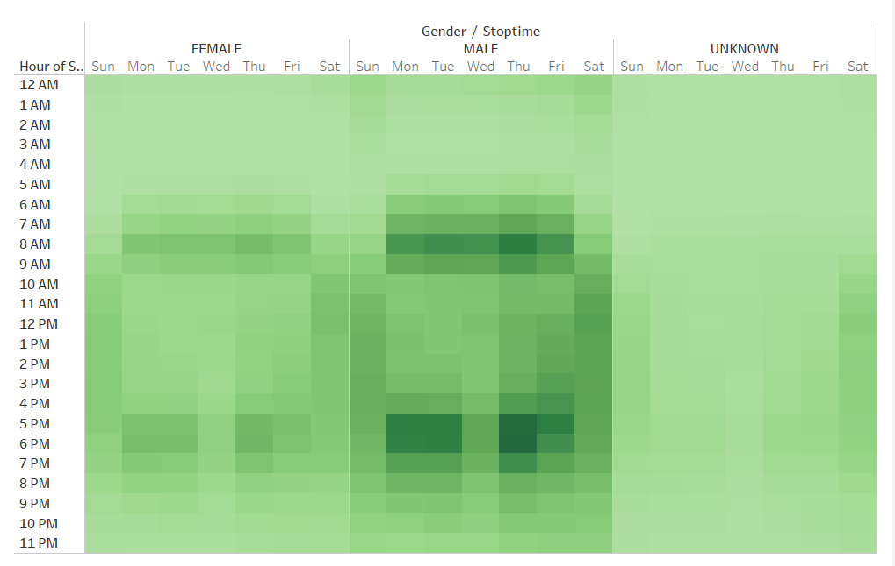
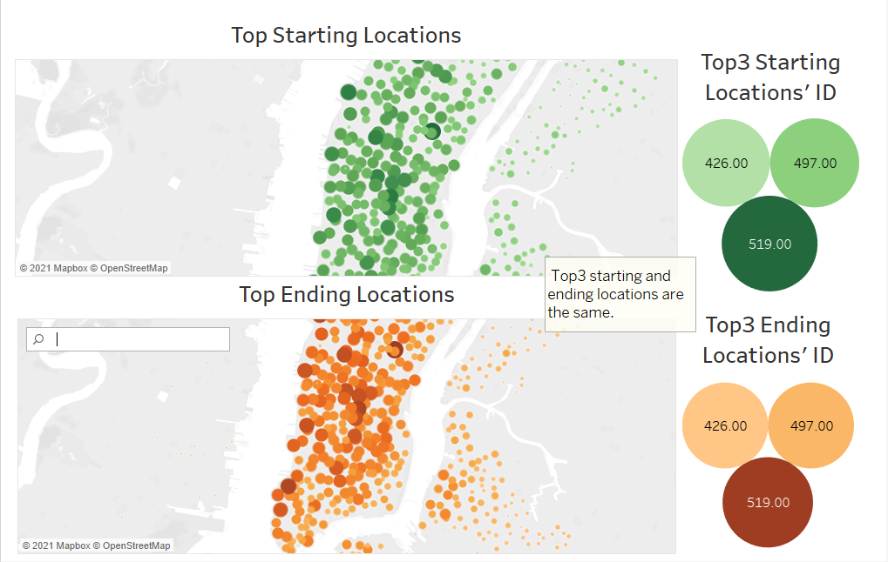

# NYC Citi Bike Sharing Analysis

## Overview

In this project, we downloaded the August 2019 data from the NYC Citi Bike program, changed the data type using Python, imported data, created dashboards and stories using Tableau. The main idea of this project was to present the situation and analysis of the Citi bike program in New York City. It should shed light on starting the same bike-sharing program in other cities.

## Results

Picture1 presented the users’ information.

Picture1

- There were 2,344,224 rides in total.
- In general, users: Male > Female > Unknown.
- We had three filters to help analyze the data. They were Gender, User Type, and User’s Birth Year.

Picture2 was the checkout times for users.

Picture2

- Trip duration of less than 1 hour had the largest user number.
- The number of users was increasing when the trip duration was between 0 and 10 minutes, it decreased when the trip duration was increasing.

Picture3 showed the checkout times by gender.

Picture3

- All genders had the same trip duration trend.
- It also confirmed the number of users: Male > Female > Unknown.

Picture4 presented the peak riding hours in August.

Picture4

- The top 3 riding hours in August were 5pm, 6pm, and 8am.

Picture5 was users’ usage of the bike by age.

Picture5

- In general, the later the birth year, the more bike usage.

Picture6 presented the number of bike trips by weekday for each hour of the day.

Picture6

- Bikes were mostly used when people went to work (8am) and off work (5-6pm).
- Bikes were mostly used from 9am to 5pm on weekends.

Picture7 was the information of the number of bike trips by gender for each hour of each day of the week. The results were consistent with what we found in the previous charts.

Picture7

Picture8 presented the number of bike trips for each type of user and gender for each day of the week.

Picture8

- For male and female, subscribers used bikes more often than customers.
- Comparing with subscribers, customers were less willing to provide gender information.

Picture9 showed starting and ending locations in NYC. The larger the number of users, the bigger and the darker the bubble.

Picture9

- The most popular starting locations and ending locations were the same.
- Most users were in the center of New York City.

## Summary

The Tableau Public link was as follows:
[Bikesharing Visualization](https://public.tableau.com/views/NYCCitiBikeChallenge_16172524516490/NYCCitiBikeStory?:language=en&:display_count=y&:origin=viz_share_link)

Our results indicated that:
Most bike users were in the center of New York City. In general, users: Male > Female > Unknown. Comparing with subscribers, customers (short-term users) were less willing to provide gender information. Trip duration less than 1 hour had the largest user number. Young people liked to use bikes comparing with elder people.

Our future virtualization could add the user type filter to the chart of total rides by age. It would shed light on user stability and its relationship with age.

We could also check the number of trips for each hour of the day by user’s age. It would give us more idea about how users who have work impact the peak riding hours.
